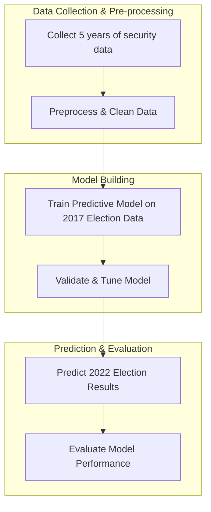

The strategy involves the utilization of historical data spanning five years prior to the target election year. This is based on the premise that past patterns and trends within a reasonable timeframe may hold predictive power for future events, such as election outcomes.

Specifically, we aim to use security-related indicators, in conjunction with election data, to train a predictive model. The security indicators include diverse categories such as acts of vandalism, environmental offenses, anti-LGBT

