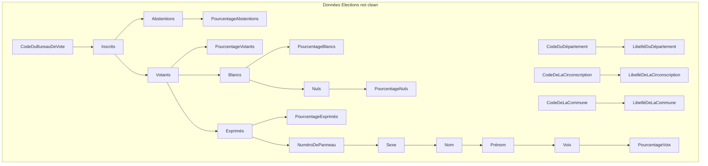

```mermaid
    graph TD

    subgraph Données Elections not clean
        CodeDuDépartement --> LibelléDuDépartement
        CodeDeLaCirconscription --> LibelléDeLaCirconscription
        CodeDeLaCommune --> LibelléDeLaCommune
        CodeDuBureauDeVote --> Inscrits
        Inscrits --> Abstentions
        Abstentions --> PourcentageAbstentions
        Inscrits --> Votants
        Votants --> PourcentageVotants
        Votants --> Blancs
        Blancs --> PourcentageBlancs
        Blancs --> Nuls
        Nuls --> PourcentageNuls
        Votants --> Exprimés
        Exprimés --> PourcentageExprimés
        Exprimés --> NuméroDePanneau
        NuméroDePanneau --> Sexe
        Sexe --> Nom
        Nom --> Prénom
        Prénom --> Voix
        Voix --> PourcentageVoix
    end
```